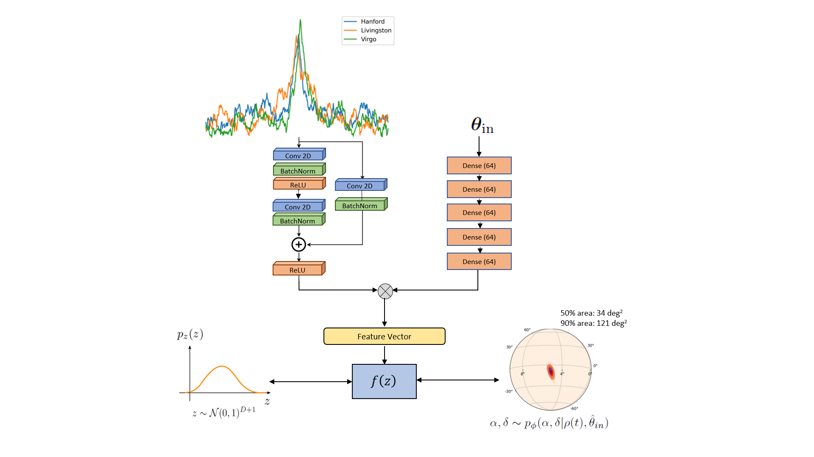

# GW-SkyLocator
This repository contains code for the paper: "Rapid localization of gravitational wave sources from compact binary coalescences using deep learning" - Chatterjee et al. (2022). 

We introduce GW-SkyLocator, a deep learing model that can estimate Right Ascension (RA) and Declination (Dec) posterior distributions from all types of compact binary coalescences - binary black holes, binary neutron stars and neutron star - black hole binary, in around 1 sec. The main component of GW-SkyLocator is a [Normalizing Flow](https://arxiv.org/abs/1505.05770), in partcular, a [Masked Autoregressive Flow](https://arxiv.org/abs/1705.07057) (MAF), trained on the complex signal-to-noise ratio (SNR) time series data obtained from matched filtering of gravitational wave strain data with optimal Numerical Relativity template waveforms. 

Normalizing Flow models learn a mapping between a simple base distribution (like a Gaussian) to a more complex distribution. In our case, we train a MAF to map samples drawn from a multivariate Gaussian (base distribution) to the more complex posterior distribution of the RA and Dec parameters. The MAF uses the [MADE](https://arxiv.org/abs/1502.03509) architecture to learn the transformation parameters that defines the mapping between the two parameter spaces. Since the RA and Dec posteriors are conditional probability distributions, we condition our MAF network on features extracted from real and imaginary parts of the SNR time series, and intrinsic source parameters (component masses and spins) using a [ResNet-34](https://arxiv.org/abs/1512.03385) and fully connected neural networks. The diagram of the network architecture is shown below: :


This code is written in Python and uses the [TensorFlow 2](https://www.tensorflow.org/) package.

# Sample Generation
The training and test set samples used for this work were generated using the repository [damonbeveridge/samplegen](https://github.com/damonbeveridge/samplegen), which adds additional features to the sample generation code written by Timothy Gebhard and Niki Kilbertus described in the paper [Convolutional neural networks: A magic bullet for gravitational-wave detection?](https://journals.aps.org/prd/abstract/10.1103/PhysRevD.100.063015) 

# Training the network
To train the model, simply run the ```main.py``` file:
```
python main.py
```
The hyperparameters of the network and the training processes can be set in the file: ```configs/config.py```.
The path to the training and test set files, saved in the OzStar Supercomputing Cluster, can be found in ```dataloader/dataloader.py```.
Codes for plotting skymaps and generating P-P plots and histograms of contour areas can be found under ```evaluation```.


